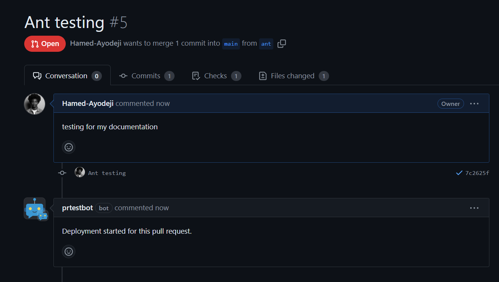
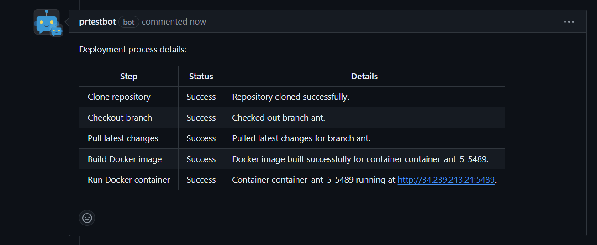
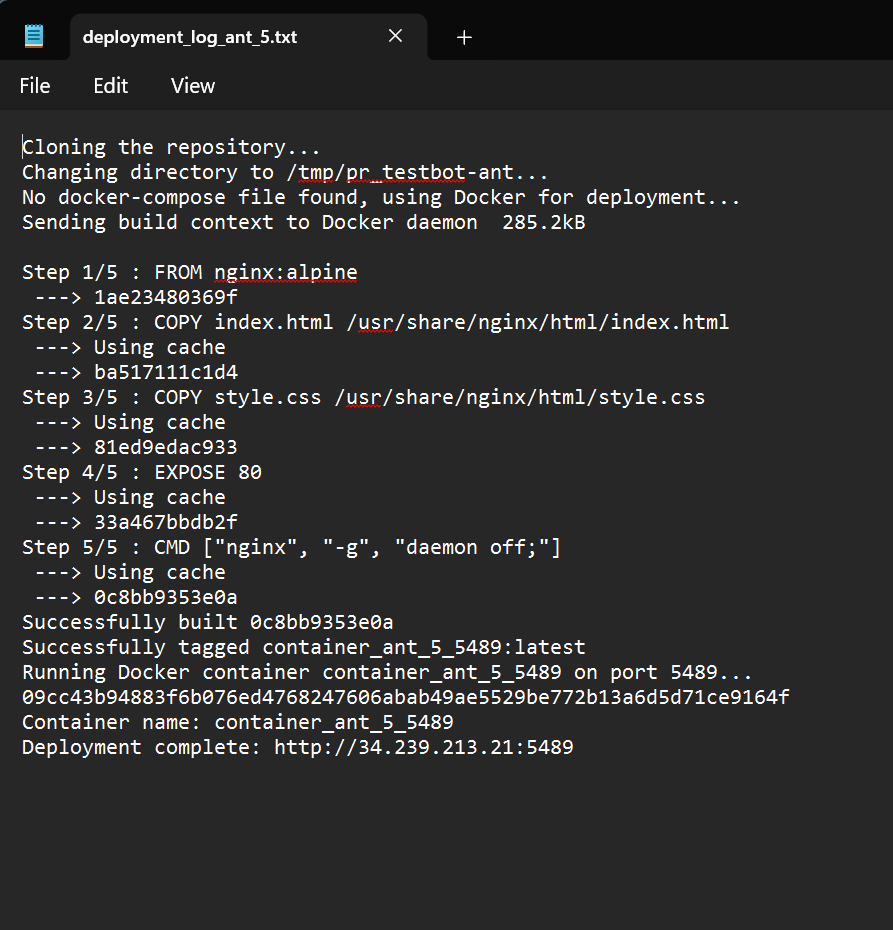
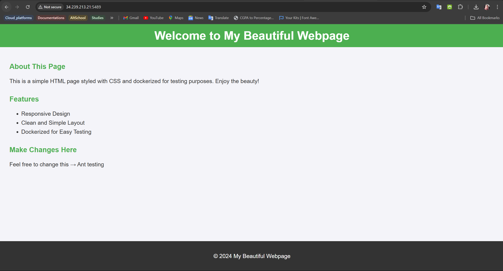
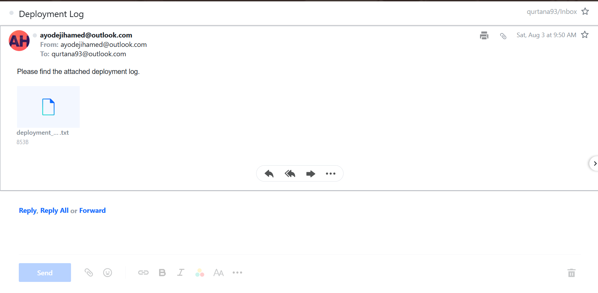
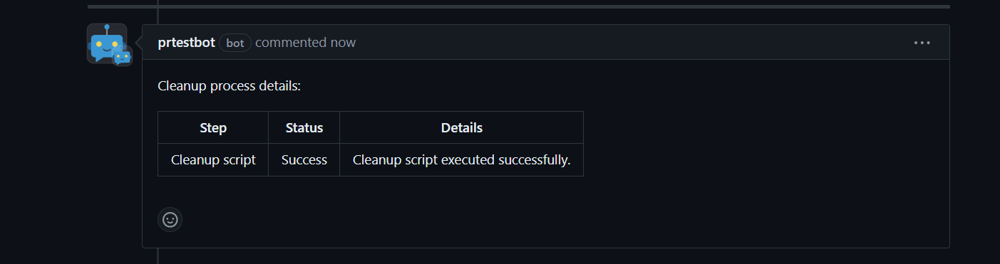
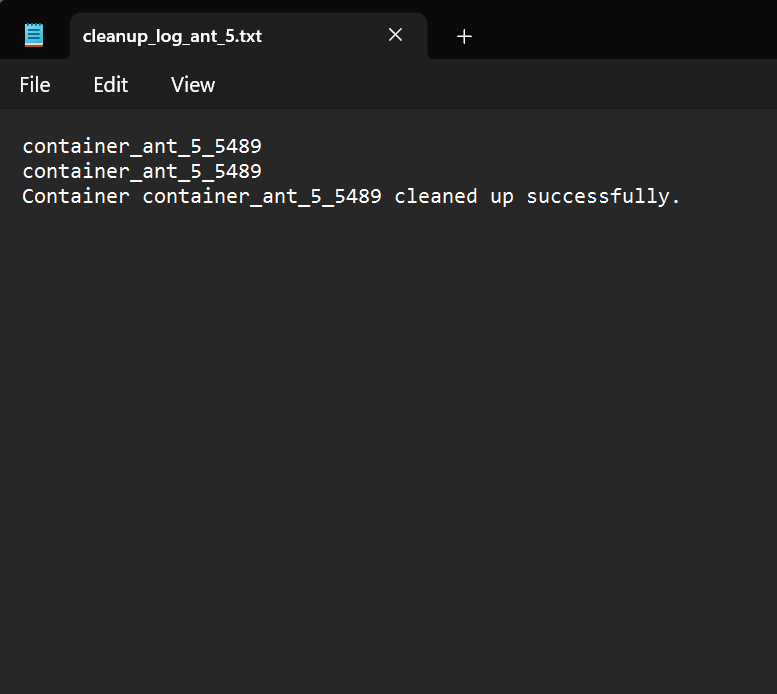
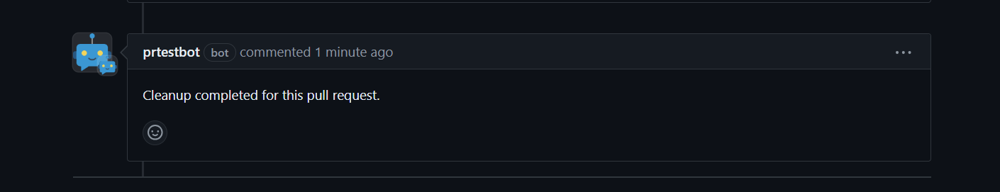
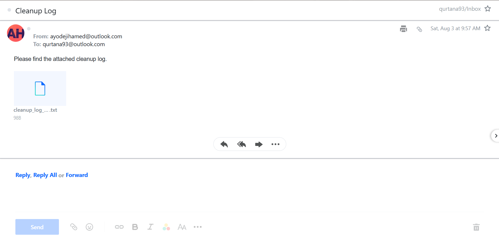

# PR_TestBot

## Introduction

In modern software development, pull requests are essential for maintaining code quality and facilitating collaboration. They allow developers to submit changes for review before merging into the main codebase, ensuring that new contributions are vetted for potential issues.

However, managing pull requests can be challenging due to:

1. **Manual Testing**: Testing every pull request manually is time-consuming and prone to errors.
2. **Delayed Feedback**: Waiting for human reviewers to provide feedback can slow down the integration process.
3. **Inconsistent Deployment**: Variations in testing environments can lead to inconsistencies.
4. **Resource Management**: Overlooking the cleanup of testing resources can waste resources and cause conflicts.

Introducing **PR_TestBot**, an automated solution to streamline the pull request testing process. PR_TestBot triggers upon the creation, update, or reopening of a pull request, deploying Docker or Docker Compose applications in a containerized environment for testing. It provides real-time feedback and notifications at each step, ensuring stakeholders are informed. Additionally, it performs automated cleanups when pull requests are closed, managing resources efficiently.

### Key Features of PR_TestBot

- **Automated Deployment**: Instantly deploys Docker or Docker Compose applications from pull requests in a consistent, isolated environment.
- **Real-time Notifications**: Keeps stakeholders informed about the deployment status through pull request comments.
- **Resource Cleanup**: Automatically cleans up containers and resources upon pull request closure.
- **Detailed Logging**: Sends detailed deployment logs via email to designated recipients.

PR_TestBot enhances productivity, ensures faster feedback, and maintains a clean development environment, improving the overall quality and reliability of the software.

## The `pr_testbot` Application (`main.py`)

The `main.py` script is the core of the `pr_testbot` application. It is a Flask-based web application that listens to GitHub webhook events and triggers deployments or cleanups based on the pull request actions.

### Key Features

- **Webhook Listener**: Listens to GitHub webhook events and verifies their signatures.
- **Authentication**: Uses JWT for GitHub App authentication and fetches installation access tokens.
- **Deployment Trigger**: Triggers the deployment script for pull request actions (opened, synchronized, reopened).
- **Cleanup Trigger**: Triggers the cleanup script when a pull request is closed.
- **Notifications**: Sends notifications to stakeholders via GitHub comments and emails detailed logs.
- **Error Handling and Logging**: Provides comprehensive error handling and logging for debugging and reliability.

[Code Overview](./main.py)

## The Deployment Script (`deploy.sh`)

The `deploy.sh` script handles the deployment process for the PR_TestBot. It clones the repository, checks out the specific branch, and deploys the application using Docker or Docker Compose.

### Key Features

- **Repository Cloning**: Clones the repository and checks out the specific branch.
- **Deployment**: Detects if a Docker Compose file is present and uses Docker Compose for deployment, otherwise uses Docker.
- **Port Allocation**: Allocates a random available port for the Docker container if Docker Compose is not used.
- **Output**: Outputs the deployment link for the deployed application.

[Code Overview](./deploy.sh)

## The Cleanup Script (`cleanup.sh`)

The `cleanup.sh` script handles the cleanup process for the PR_TestBot. It stops and removes Docker containers or Docker Compose services created during deployment.

### Key Features

- **Service Detection**: Detects if Docker Compose services are used and stops them accordingly.
- **Container Cleanup**: Stops and removes individual Docker containers if Docker Compose is not used.
- **Logging**: Provides feedback on the cleanup process for each container or service.

[Code Overview](./cleanup.sh)

## Prerequisites

1. **Server**: A running server (e.g., AWS EC2, DigitalOcean Droplet, or any other cloud provider) with Ubuntu.

2. **GitHub Repository**: A repository with Docker or Docker Compose configuration.

3. **Security Group/Firewall**:
   - Open port 22 (SSH).
   - Open port 5000 (Flask).
   - Open ports 4000-7000 (for Docker container deployment).

4. **SSH Key Pair**: Access to the server via SSH.

5. **Software on the Server**:
   - Docker
   - Docker Compose
   - Python 3 and pip
   - snapd
   - screen
   - ngrok

6. **Environment Variables**:
   - `WEBHOOK_SECRET`
   - `APP_ID`
   - `PRIVATE_KEY_PATH`
   - `SMTP_SERVER`
   - `SMTP_PORT`
   - `SMTP_USERNAME`
   - `SMTP_PASSWORD`
   - `RECIPIENT_EMAIL`

7. **ngrok Authtoken**: An ngrok account with an authtoken.

## Setting up the Test Server

1. **Launch an AWS EC2 Instance**:
   - Select **t2.micro** instance type with an Ubuntu AMI.

2. **Configure Security Group**:
   - Open ports **22** (SSH), **5000** (Flask), and any other necessary ports.

3. **Connect to the Instance**:

   ```sh
   ssh -i /path/to/your-key.pem ubuntu@your-ec2-instance-public-dns
   ```

4. **Install Required Software**:

   ```sh
   sudo apt update
   sudo apt install docker.io docker-compose python3 python3-pip snapd screen
   sudo snap install ngrok
   ```

5. **Set Up Docker and Docker Compose**:
   - Enable and start Docker:

   ```sh
   sudo systemctl enable docker
   sudo systemctl start docker
   sudo usermod -aG docker $USER
   newgrp docker
   ```

6. **Set Up ngrok**:

   ```sh
   ngrok authtoken your-ngrok-authtoken
   ```

7. **Clone Your Repository**:

   ```sh
   git clone https://github.com/your-username/your-repo.git
   cd your-repo
   ```

8. **Set Up Environment Variables**:
   - Create a `.env` file with the necessary variables.

9. **Install Python Dependencies**:

   ```sh
   pip3 install -r requirements.txt
   ```

10. **Run Flask App and ngrok in Screen Sessions**:

    ```sh
    screen -S flask
    python3 main.py
    # Press Ctrl+A, then D to detach

    screen -S ngrok
    ngrok http 5000
    # Press Ctrl+A, then D to detach
    ```

Your test server is now ready to deploy and test pull requests using PR_TestBot.

## Detailed Steps to Install PR_TestBot on GitHub

### Step 1: Create a GitHub App

1. **Go to GitHub Settings**:
   - Navigate to your GitHub account settings by clicking on your profile picture in the top-right corner and selecting "Settings".

2. **Developer Settings**:
   - In the left-hand sidebar, scroll down and click on "Developer settings".

3. **GitHub Apps**:
   - Click on "GitHub Apps" in the left sidebar.

4. **Create a New GitHub App**:
   - Click the "New GitHub App" button.

5. **Configure the GitHub App**:
   - **App name**: Enter a name for your app (e.g., `PR_TestBot`).
   - **Homepage URL**: Enter your homepage URL or the URL of your repository.
   - **Webhook URL**: Set this to your ngrok URL (e.g., `http://your-ngrok-url.ngrok.io/webhook`).
   - **Webhook Secret**: Enter a secret key (make note of this for later).
   - **Repository Permissions**:
     - **Contents**: Read-only
     - **Issues**: Read & write
     - **Pull requests**: Read & write
     - **Commit statuses**: Read & write
   - **Subscribe to Events**:
     - Check the box for "Pull request".
   - **Where can this GitHub App be installed?**: Choose "Any account".

6. **Create GitHub App**:
   - Click the "Create GitHub App" button.

7. **Generate a Private Key**:
   - After creating the app, generate a private key and save the `.pem` file. This will be used for authentication.

### Step 2: Install the GitHub App on Your Repository

1. **Install GitHub App**:
   - After creating the app, you will see an option to install it. Click on the "Install App" button.

2. **Select Repository**:
   - Choose "Only select repositories" and select the repository where you want to install the app (e.g., `your-repo-name`).

3. **Complete Installation**:
   - Click the "Install" button to complete the installation.

### Step 3: Set Up the Server

Follow the instructions in the "Setting up the Test Server" section of your documentation to prepare the server.

### Step 4: Clone the Repository

1. **Clone Your Repository**:

   ```sh
   git clone https://github.com/Hamed-Ayodeji/pr_testbot.git
   cd pr_testbot
   ```

2. **Set Up Environment Variables**:
   - Create a `.env` file in the project directory with the following content:

     ```plaintext
     WEBHOOK_SECRET=your_webhook_secret
     APP_ID=your_github_app_id
     PRIVATE_KEY_PATH=/path/to/your/private-key.pem
     SMTP_SERVER=smtp.your-email-provider.com
     SMTP_PORT=587
     SMTP_USERNAME=your_smtp_username
     SMTP_PASSWORD=your_smtp_password
     RECIPIENT_EMAIL=recipient@example.com
     ```

### Step 5: Set Up and Activate a Virtual Environment

1. **Install `virtualenv`**:

   ```sh
   sudo apt install python3-virtualenv
   ```

2. **Create a Virtual Environment**:

   ```sh
   virtualenv venv
   ```

3. **Activate the Virtual Environment**:

   ```sh
   source venv/bin/activate
   ```

4. **Install Python Dependencies**:

   ```sh
   pip install -r requirements.txt
   ```

### Step 6: Run the Flask App and ngrok

1. **Start the Flask Application in a Screen Session**:

   ```sh
   screen -S flask
   source venv/bin/activate
   python3 main.py
   # Press Ctrl+A, then D to detach
   ```

2. **Start ngrok in a Screen Session**:

   ```sh
   screen -S ngrok
   ngrok http 5000
   # Press Ctrl+A, then D to detach
   ```

3. **Copy the ngrok URL**:
   - After starting ngrok, copy the generated URL (e.g., `http://your-ngrok-url.ngrok.io`).

### Step 7: Update GitHub App Webhook URL

1. **Update Webhook URL**:
   - Go back to the GitHub Developer settings and navigate to your GitHub App settings.
   - Update the "Webhook URL" with your ngrok URL followed by `/webhook` (e.g., `http://your-ngrok-url.ngrok.io/webhook`).

### Step 8: Test PR_TestBot

1. **Create a Pull Request**:
   - Make a change in a branch of your repository and create a pull request to trigger the bot.

2. **Monitor the Deployment**:
   - The bot should automatically deploy the code, notify stakeholders, and provide detailed status updates.

By following these steps, you will have PR_TestBot installed on GitHub, with the ability to deploy Docker or Docker Compose applications, provide notifications, and manage resources efficiently.

## A Simple Demonstration of the `pr_testbot` in Action with Screenshots, Using the `pr_testbot_test` Repository

### Step 1: Cloning the Repository and Creating a Pull Request

1. **Clone the Repository**: Clone the `pr_testbot_test` repository to your local machine.

   ```bash
   git clone https://github.com/Hamed-Ayodeji/pr_testbot_test.git
   cd pr_testbot_test
   ```

2. **Create a New Branch**: Create and switch to a new branch to make your changes.

   ```bash
   git checkout -b feature-test
   ```

3. **Make Changes**: Make some changes to the code. For example, update the README file.

4. **Commit and Push Changes**: Commit and push your changes to GitHub.

   ```bash
   git add .
   git commit -m "Test changes for pr_testbot"
   git push origin feature-test
   ```

5. **Open a Pull Request**: Open a pull request from the `feature-test` branch to the `main` branch.
   - Go to the repository on GitHub.
   - Click the "Compare & pull request" button.
   - Provide a title and description for your pull request and click "Create pull request".

### Step 2: Deployment Triggered by Pull Request

Once the pull request is created, the `pr_testbot` is triggered and starts the deployment process.

1. **Webhook Received**: The `pr_testbot` receives the webhook event for the new pull request.
   - 

2. **Deployment Started**: The bot posts a comment on the pull request indicating that the deployment has started.
   - 

3. **Deployment Log**: The bot performs the deployment, clones the repository, checks out the branch, and deploys the application.
   - 

4. **Deployment Success**: Once the deployment is successful, the bot posts another comment with the deployment link.
   - 

### Step 3: Receiving Deployment Logs via Email

After the deployment, the bot sends detailed logs of the deployment process via email to the configured recipient. The email contains the following information:

- **Repository URL**: The URL of the repository from which the branch was cloned.
- **Branch Name**: The name of the branch that was deployed.
- **Deployment Steps**: Detailed steps of the deployment process including cloning, checking out the branch, building the Docker image, and running the container.
- **Deployment Status**: The status of each step, indicating success or failure.
- **Deployment URL**: The URL of the deployed application if the deployment was successful.

**Example Email with Deployment Logs**:

- 

### Step 4: Closing the Pull Request

1. **Merge or Close the Pull Request**: Once the changes are reviewed, the pull request can be merged or closed.

2. **Cleanup Triggered**: When the pull request is closed, the `pr_testbot` triggers the cleanup process.
   - 

3. **Cleanup Log**: The bot performs the cleanup, stopping and removing Docker containers or Docker Compose services.
   - 

4. **Cleanup Success**: The bot posts a final comment indicating that the cleanup has been completed successfully.
   - 

### Step 5: Receiving Cleanup Logs via Email

Similar to the deployment logs, the bot also sends detailed logs of the cleanup process via email to the configured recipient. The email contains the following information:

- **Repository URL**: The URL of the repository from which the branch was cloned.
- **Branch Name**: The name of the branch that was cleaned up.
- **Cleanup Steps**: Detailed steps of the cleanup process including stopping and removing Docker containers or Docker Compose services.
- **Cleanup Status**: The status of each step, indicating success or failure.

**Example Email with Cleanup Logs**:

- 

This demonstration shows how the `pr_testbot` automates the deployment and cleanup processes for pull requests, ensuring that applications are tested in a consistent environment and resources are cleaned up after use. The detailed comments and logs provided by the bot help stakeholders track the status of deployments and cleanups effectively.

### Other Ways to Test

**Forking the Repository**:

1. **Fork the Repository**: Fork the `pr_testbot_test` repository to your GitHub account.
   - Navigate to the repository URL: `https://github.com/Hamed-Ayodeji/pr_testbot_test`.
   - Click on the "Fork" button in the top-right corner of the page.

2. **Clone the Forked Repository**: Clone the forked repository to your local machine.

   ```bash
   git clone https://github.com/YOUR-USERNAME/pr_testbot_test.git
   cd pr_testbot_test
   ```

3. **Follow Steps 2-5**: Create a new branch, make changes, commit, push, and open a pull request following the same steps as described above.

**Creating a Pull Request from a Different Branch**:

1. **Clone the Repository**: Clone the repository to your local machine.

   ```bash
   git clone https://github.com/Hamed-Ayodeji/pr_testbot_test.git
   cd pr_testbot_test
   ```

2. **Create a New Branch**: Create and switch to a new branch to make your changes.

   ```bash
   git checkout -b new-feature-branch
   ```

3. **Make Changes**: Make some changes to the code.

4. **Commit and Push Changes**: Commit and push your changes to GitHub.

   ```bash
   git add .
   git commit -m "New feature branch changes"
   git push origin new-feature-branch
   ```

5. **Open a Pull Request**: Open a pull request from the `new-feature-branch` to the `main` branch on GitHub.

These methods provide flexibility in testing the `pr_testbot` with various scenarios, ensuring it functions correctly across different use cases.

### Security Considerations

When implementing and using the `pr_testbot`, it is crucial to keep security at the forefront. Here are some key security considerations:

1. **Webhook Security**:
   - **Signature Verification**: Ensure that all incoming webhooks from GitHub are verified using the provided signature to prevent unauthorized access.
   - **Secret Management**: Store webhook secrets securely and avoid hardcoding them in your scripts.

2. **Environment Variables**:
   - **Secure Storage**: Use secure methods to store environment variables such as AWS Secrets Manager, HashiCorp Vault, or similar services.
   - **Access Control**: Limit access to environment variables to only those processes and users that absolutely need them.

3. **Authentication Tokens**:
   - **Short-lived Tokens**: Use short-lived tokens for authentication wherever possible and rotate them regularly.
   - **Encryption**: Ensure that all tokens and sensitive data are encrypted both in transit and at rest.

4. **Server Security**:
   - **Firewall Rules**: Configure firewall rules to allow only necessary traffic to and from your server.
   - **Regular Updates**: Keep your server and all dependencies updated with the latest security patches.

5. **Docker Security**:
   - **Image Vulnerabilities**: Regularly scan your Docker images for vulnerabilities using tools like Docker Bench for Security or Clair.
   - **Least Privilege**: Run containers with the least privilege necessary and avoid running containers as root.

### Future Plans for the `pr_testbot`

The current implementation of `pr_testbot` focuses on deploying Docker applications. Future plans for the `pr_testbot` include extending its capabilities to support a variety of deployment tools and environments. Here are some future enhancements:

1. **Terraform**:
   - Integrate Terraform to provision and manage infrastructure as code.
   - Allow deployment scripts to apply Terraform configurations and manage cloud resources dynamically.

2. **Ansible**:
   - Add support for Ansible to automate IT tasks such as configuration management, application deployment, and orchestration.
   - Enable the deployment script to run Ansible playbooks for setting up and managing environments.

3. **Kubernetes**:
   - Support for deploying applications to Kubernetes clusters.
   - Enable the deployment script to apply Kubernetes manifests and manage Kubernetes resources.

4. **CI/CD Integration**:
   - Integrate with popular CI/CD tools like Jenkins, CircleCI, or GitHub Actions to automate the entire deployment pipeline.
   - Provide feedback and status updates directly within these CI/CD platforms.

5. **Extensible Plugin System**:
   - Develop a plugin system that allows users to easily add support for other deployment tools and technologies.
   - Enable community contributions to extend the capabilities of the `pr_testbot`.

### Summary

The `pr_testbot` is a powerful automation tool designed to streamline the deployment and cleanup processes for pull requests. Key features of the `pr_testbot` include:

- Automated deployments triggered by pull request actions.
- Detailed notifications and logs sent via GitHub comments and emails.
- Secure handling of webhook events and authentication tokens.
- Flexible deployment options with support for Docker and Docker Compose.

### Conclusion

The `pr_testbot` provides an efficient and secure way to manage deployments and cleanups for pull requests, ensuring consistency and reliability in testing environments. With planned future enhancements, the `pr_testbot` aims to become a versatile tool capable of handling various deployment technologies and integrating seamlessly into modern CI/CD pipelines.

By leveraging the `pr_testbot`, development teams can focus more on building and improving their applications, knowing that their deployment processes are automated and secure.
